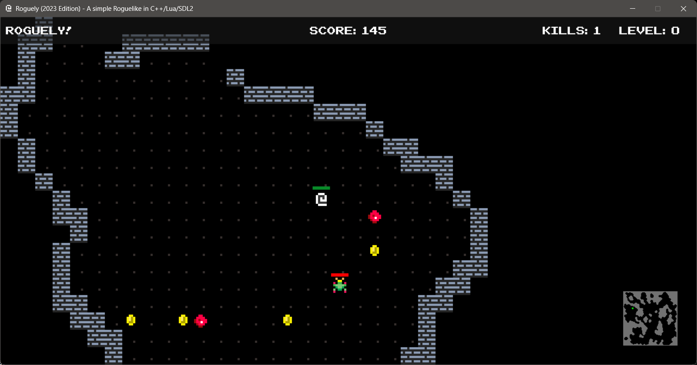
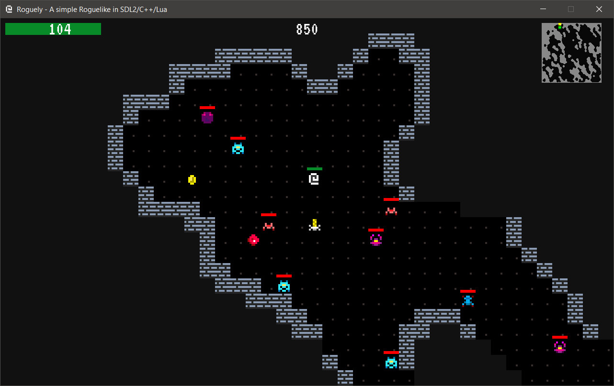

# Roguely


Roguely is a very simple Roguelike in SDL/C++/Lua.

The game is using very simple cellular automata algorithm to generate maps.
Each time you run the game you'll get a new map. Enemies spawn, move around
randomly and you can attack them to increase your score. You can pick up health
gems and coins. Dead enemies can spawn a treasure chests which increase score.
Look for the golden candle and if you collect it you will win the game.

There is no real point to the game. It was a fun exercise to create an engine
and integrate Lua into it.

## Screenshots

Title Screen:


Combat Text:


Current Gameplay:



Older gameplay showing how it evolved:




My first screenshot when I was able to render sprites:


## Videos

[](https://www.youtube.com/watch?v=Bs1GXWLNYok)

[](https://www.youtube.com/watch?v=IOBuFlfgCSE)

## Building

This code uses `vcpkg` and for dependencies management and `cmake` to build. This expects a sand build environment to be installed. I've installed `Visual Studio 2022` and use `Visual Studio Code` to develop the game.

You can get `vckpg` here: [https://github.com/Microsoft/vcpkg](https://github.com/Microsoft/vcpkg)

You can get `Visual Studio` here:
[https://visualstudio.microsoft.com/downloads/](https://visualstudio.microsoft.com/downloads/)

You can get `Visual Studio Code` here:
[https://code.visualstudio.com/](https://code.visualstudio.com/)

Roguely has the following dependencies which are managed by `vcpkg`:

- SDL2
- SDL_image
- SDL_mixer (with mpg123 support)
- SDL_ttf
- Lua
- Sol2
- Boost (using boost/uuid, boost/matrix)
- magic_enum
- fmt

## How to use the game engine

This engine provides a simple Entity Component System and exposes that to Lua.
Since this engine uses SDL2 it also exposes several SDL2 functions to Lua to
make creating grid turn based games easier. The engines primary design is to
make creating grid turn based games easier.

The engine expects that the `roguely.lua` file will have a global table called
`Game` which at the least defines the following properties:

```lua
Game = {
  window_title = "Roguely (2023 Edition) - A simple Roguelike in C++/Lua/SDL2",
  window_icon_path = "assets/icon.png",
  window_width = 1280,
  window_height = 640,
  map_width = 100,
  map_height = 100,
  spritesheet_name = "roguely-x",
  spritesheet_path = "assets/roguely-x.png",
  spritesheet_sprite_width = 8,
  spritesheet_sprite_height = 8,
  spritesheet_sprite_scale_factor = 4,
  font_path = "assets/NESCyrillic.ttf",
  soundtrack_path = "assets/ExitExitProper.mp3",
  logo_image_path = "assets/roguely-logo.png",
  start_game_image_path = "assets/press-space-bar-to-play.png",
  credit_image_path = "assets/credits.png",
  sounds = {
      coin = "assets/sounds/coin.wav",
      bump = "assets/sounds/bump.wav",
      combat = "assets/sounds/combat.wav",
      death = "assets/sounds/death.wav",
      pickup = "assets/sounds/pickup.wav",
      warp = "assets/sounds/warp.wav",
      walk = "assets/sounds/walk.wav"
  },
  entities = {
    player = {
      components = {
          sprite_component = {
              name = "player",
              spritesheet_name = "roguely-x",
              sprite_id = 15,
              blink = false,
              render = function(self, game, player, dx, dy, scale_factor)
                  -- handle sprite player render here
              end
          },
          position_component = { x = 0, y = 0 },
          stats_component = {
              max_health = 50,
              health = 50,
              health_recovery = 10,
              attack = 5,
              crit_chance = 2,
              crit_multiplier = 2,
              score = 0,
              kills = 0,
              level = 0,
              experience = 0,
          },
          healthbar_component = {
            -- handle render of health bar
          },
          tick_component = {
            -- handle what occurs during a game tick (every one second)
          }
      }
    }
  }
}
```

When games are started up the engine first looks to make sure required
properties are in the `Game` table and then it calls `_init()`. This function
can be used to setup your game. You can spawn entities, set up your maps, etc...

It's expected that during the intialization you will add various system
functions that will be called in order to handle game entities.

For instance:

```lua
add_system("render_system", render_system)
add_system("keyboard_input_system", keyboard_input_system)
add_system("combat_system", combat_system)
add_system("leveling_system", leveling_system)
add_system("loot system", loot_system)
add_system("tick_system", tick_system)
add_system("mob_movement_system", mob_movement_system)
```

Systems are just functions that look like:

```lua
function keyboard_input_system(key, player, entities, entities_in_viewport)
end
```

Have a look at `roguely.lua` to see how more about how to use the engine.

## Lua APIs

`get_sprite_info` - Returns a Lua table with information about sprites in a
sprite sheet.

`draw_text` - Draws white text to the screen.

`draw_text_with_color` - Draws text to the screen with a specific color.

`draw_sprite` - Draws a sprite to the screen.

`draw_sprite_scaled` - Draws a sprite to the screen scaled by a factor.

`draw_sprite_sheet` - Draws a sprite sheet to the screen.

`set_draw_color` - Sets the draw color.

`draw_point` - Draws a point to the screen.

`draw_rect` - Draws a rectangle to the screen.

`draw_filled_rect` - Draws a filled rectangle to the screen.

`draw_filled_rect_with_color` - Draws a filled rectangle to the screen with a specific color.

`draw_graphic` - Draws a graphic to the screen.

`play_sound` - Plays a sound.

`get_random_number` - Returns a random number.

`generate_uuid` - Returns a UUID.

`generate_map` - Generates a map using a cellular automata algorithm.

`get_random_point_on_map` - Returns a random open point on the map (eg not a
wall).

`set_map` - Sets the map.

`draw_visible_map` - Draws the visible map (eg. what's visible in the current
viewport).

`draw_full_map` - Draws the full map (great for minimaps).

`add_entity` - Adds an entity to the game.

`remove_entity` - Removes an entity from the game.

`remove_component` - Removes a component from an entity.

`get_component_value` - Returns the value of a component (deprecated).

`set_component_value` - Sets the value of a component (deprecated).

`update_player_viewport` - Updates the player viewport.

`get_text_extents` - Returns the width and height of a string.

`add_system` - Adds a system to the game.

`get_random_key_from_table` - Returns a random key from a table.

`find_entity_with_name` - Returns an entity with a specific name (finds based on starts with).

`get_overlapping_points` - Returns a list of points that overlap with a given
point.

`get_blocked_points` - Returns a list of points that are blocked (eg. walls).

`is_within_viewport` - Returns true if a point is within the viewport.

`force_redraw_map` - Forces a redraw of the map.

`add_font` - Adds a font.

`set_font` - Sets the font.

`get_adjacent_points` - Returns a list of points that are adjacent to a given
point (up, down, left and right).

`map_to_world` - Converts a map point to a world point.

`set_highlight_color` - Sets the highlight color.

`reset_highlight_color` - Resets the highlight color.

## License

MIT

## Credits for Audio

Music track `Exit Exit Proper - Pipe Choir` from:

- [http://www.pipechoir.com/](http://www.pipechoir.com/)
- [https://soundcloud.com/pipe-choir-three](https://soundcloud.com/pipe-choir-three)
- [https://freemusicarchive.org/music/P_C_III](https://freemusicarchive.org/music/P_C_III)

Creative Commons License: <http://www.pipechoir.com/music-licenses.html>

The sounds in the `assets/sounds` folder came from [https://opengameart.org/](https://opengameart.org/)

## Author(s)

Frank Hale &lt;<frankhaledevelops@gmail.com>&gt;

## Date

21 June 2023
